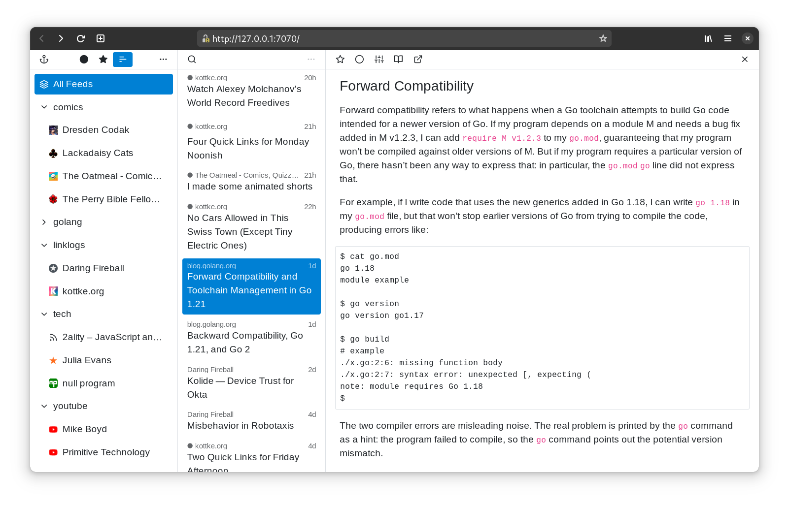

<!--
N.B.: Aquest README ha estat generat automàticament per <https://github.com/YunoHost/apps/tree/master/tools/readme_generator>
NO s'ha de modificar manualment.
-->

# Yarr per YunoHost

[](https://ci-apps.yunohost.org/ci/apps/yarr/)


[](https://install-app.yunohost.org/?app=yarr)

*[Llegeix aquest README en altres idiomes.](./ALL_README.md)*

> *Aquest paquet et permet instal·lar Yarr de forma ràpida i senzilla en un servidor YunoHost.*  
> *Si no tens YunoHost, consulta [la guia](https://yunohost.org/install) per saber com instal·lar-lo.*

## Visió general

yarr (yet another rss reader) is a web-based feed aggregator which can be used both as a desktop application and a personal self-hosted server.

**Versió inclosa:** 2.5~ynh1

## Captures de pantalla



## Documentació i recursos

- Repositori oficial del codi de l'aplicació: <https://github.com/nkanaev/yarr>
- Botiga YunoHost: <https://apps.yunohost.org/app/yarr>
- Reportar un error: <https://github.com/YunoHost-Apps/yarr_ynh/issues>

## Informació per a desenvolupadors

Envieu les pull request a la [branca `testing`](https://github.com/YunoHost-Apps/yarr_ynh/tree/testing).

Per provar la branca `testing`, procedir com descrit a continuació:

```bash
sudo yunohost app install https://github.com/YunoHost-Apps/yarr_ynh/tree/testing --debug
o
sudo yunohost app upgrade yarr -u https://github.com/YunoHost-Apps/yarr_ynh/tree/testing --debug
```

**Més informació sobre l'empaquetatge d'aplicacions:** <https://yunohost.org/packaging_apps>
